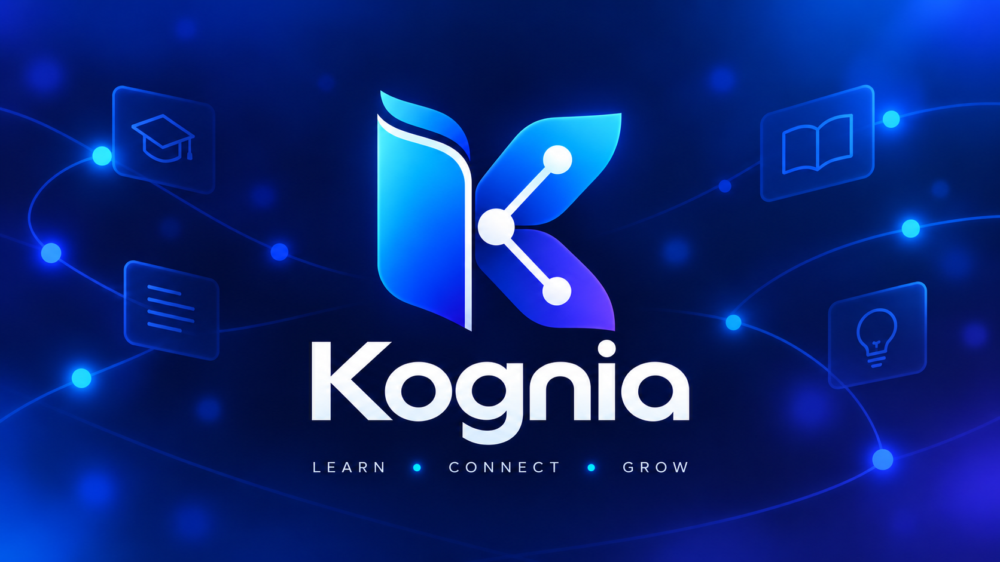

<p align="center">
 
</p>

<p align="center">

</p>

<div align="center">


<br/>


<br/><br/>

<a href="https://github.com/Jairo0811/Kognia/actions/workflows/ci.yml">
  
</a>
<a href="https://github.com/Jairo0811/Kognia/actions/workflows/release-candidate.yml">
  
</a>

<br/><br/>

**Aprende. Avanza. Domina.**

*Learning paths, assessments, certifications and measurable progress.*

</div>

## 📌 Descripción

**Kognia** es una plataforma SaaS moderna de aprendizaje orientada a cursos, rutas formativas, evaluaciones, certificaciones, suscripciones, engagement y progreso medible del estudiante.

El producto actual es una reconstrucción completa del concepto académico original desarrollado en UNAPEC. La versión 2026 utiliza una arquitectura moderna con **.NET 10, React 19, TypeScript y SQL Server**, además de contenedores, CI y un flujo dedicado de Release Candidate.

---

## 🎓 Información académica

| Información | Detalle |
|---|---|
| 🏫 Institución | **Universidad APEC (UNAPEC)** |
| 📖 Asignatura | **Gestión de Sitios Web (ISO-700)** |
| 👨‍🏫 Profesor | **Delby Acosta Taveras** |
| 📅 Período académico | **Mayo - Agosto 2024** |
| 📁 Tipo de entrega | **Proyecto Final** |
| 🛠️ Reconstrucción | **2026 — SaaS / portafolio profesional** |

### 👥 Equipo académico original

| 👤 Integrante | 🆔 Matrícula |
|---|---|
| 👨🏻‍💻 Ramon Rosario Rodriguez | A00110961 |
| 👨🏻‍💻 Eliandres Rodriguez Cepeda | A00112070 |
| 👨🏻‍💻 Francis Jairo Matias Rosario | A00115261 |

La trazabilidad histórica ampliada se conserva en [`docs/original-unapec-project.md`](docs/original-unapec-project.md).

---

## 🧭 Continuidad académica

### 👥 Continuidad por estudiante

**Eliandres Rodriguez Cepeda (A00112070)** participó junto a Francis Jairo Matias Rosario en **Kognia**, correspondiente a **Gestión de Sitios Web (ISO-700)** durante **Mayo - Agosto 2024**. En **Septiembre - Diciembre 2026**, ambos vuelven a coincidir en [**BonitaSoft**](https://github.com/Jairo0811/BonitaSoft), proyecto de **Integración de Aplicaciones con Tecnología Open Source (ISO-815)**.

| Orden | Asignatura | Proyecto | Período |
|---:|---|---|---|
| 1 | Gestión de Sitios Web (ISO-700) | **Kognia** | Mayo - Agosto 2024 |
| 2 | Integración de Aplicaciones con Tecnología Open Source (ISO-815) | [**BonitaSoft**](https://github.com/Jairo0811/BonitaSoft) | Septiembre - Diciembre 2026 |

> **Alcance de Eliandres:** participa en **BonitaSoft / ISO-815** y **no pertenece a SOAForge**, que corresponde exclusivamente a **ISO-810**.

La relación es **académica y cronológica**. Kognia y BonitaSoft son proyectos independientes y no existe dependencia técnica entre ambos.

---

## 🧱 Stack tecnológico

### 🎨 Frontend

<p>
  
  
  
</p>

- React 19;
- TypeScript 5.9;
- Vite 7;
- React Router 7;
- TanStack Query 5;
- Font Awesome;
- ESLint.

### ⚙️ Backend

<p>
  
  
  
</p>

- .NET 10;
- ASP.NET Core Web API;
- Entity Framework Core;
- ASP.NET Core Identity;
- JWT + refresh tokens;
- Clean Architecture;
- xUnit integration and architecture tests.

### 🗄️ Datos

<p>
  
</p>

- Microsoft SQL Server;
- persistencia mediante Entity Framework Core;
- migraciones y configuración por entorno.

### 🧪 Plataforma, calidad y DevOps

<p>
  
</p>

- Docker / Docker Compose;
- Nginx para frontend en plantilla de producción;
- Git / GitHub;
- GitHub Actions;
- workflow de CI;
- workflow dedicado de Release Candidate;
- lint, build y tests automatizados.

---

## ✨ Alcance funcional

Kognia incluye actualmente:

- identidad, roles y autenticación;
- catálogo y autoría de cursos;
- rutas de aprendizaje;
- inscripciones y progreso;
- evaluaciones y calificaciones;
- certificados verificables;
- suscripciones y persistencia de facturación;
- dashboards para estudiante, instructor y administración;
- reseñas y favoritos;
- notificaciones;
- analítica sensible al rol;
- navegación autenticada y experiencia de dashboard refinada;
- branding oficial integrado en la experiencia y certificados.

---

## 🏗️ Arquitectura

```text
Kognia/
├── backend/
│   ├── src/
│   │   ├── Kognia.Domain/
│   │   ├── Kognia.Application/
│   │   ├── Kognia.Infrastructure/
│   │   └── Kognia.Api/
│   ├── tests/
│   └── Dockerfile
├── frontend/
│   ├── public/branding/
│   ├── src/
│   ├── Dockerfile
│   └── nginx.conf
├── docs/
├── .github/workflows/
│   ├── ci.yml
│   └── release-candidate.yml
├── docker-compose.yml
└── docker-compose.production.yml
```

Flujo principal:

```text
React Web
   ↓ HTTPS / JSON
ASP.NET Core Web API
   ↓
Application / Domain / Infrastructure
   ↓
Entity Framework Core
   ↓
SQL Server
```

---

## 🌿 Flujo de desarrollo

```text
main
└── dev
    └── feature/*
```

- `main`: releases estables;
- `dev`: integración;
- `feature/*`: trabajo incremental por capacidad.

---

## 🚀 Desarrollo local

### Base de datos

```bash
docker compose up -d
```

### Backend

```bash
cd backend
dotnet restore Kognia.slnx
dotnet run --project src/Kognia.Api
```

### Frontend

```bash
cd frontend
npm install
npm run dev
```

### Plantilla de producción

Configure valores fuertes y administrados por entorno para `MSSQL_SA_PASSWORD`, `JWT_KEY` y `PUBLIC_ORIGIN` y ejecute:

```bash
docker compose -f docker-compose.production.yml up -d --build
```

Los secretos y credenciales de desarrollo no deben reutilizarse en producción.

---

## 🔄 Integración continua

El workflow [`ci.yml`](.github/workflows/ci.yml) valida:

- restore, build y tests del backend;
- instalación, lint y build del frontend.

El workflow [`release-candidate.yml`](.github/workflows/release-candidate.yml) actúa como gate adicional de la etapa Release Candidate.

---

## 📊 Estado actual

**Release Candidate — Fases 0–16 implementadas.**

La implementación funcional del alcance planificado está completada. El lanzamiento productivo continúa condicionado por aprovisionamiento de infraestructura y credenciales/servicios reales de proveedores cuando corresponda.

Documentación de cierre:

- [`docs/roadmap.md`](docs/roadmap.md);
- [`docs/final-block.md`](docs/final-block.md);
- documentos de validación bajo `docs/`.

---

<p align="center">
  <strong>Kognia · Aprende. Avanza. Domina.</strong><br/>
  Universidad APEC (UNAPEC) · Gestión de Sitios Web (ISO-700)
</p>
